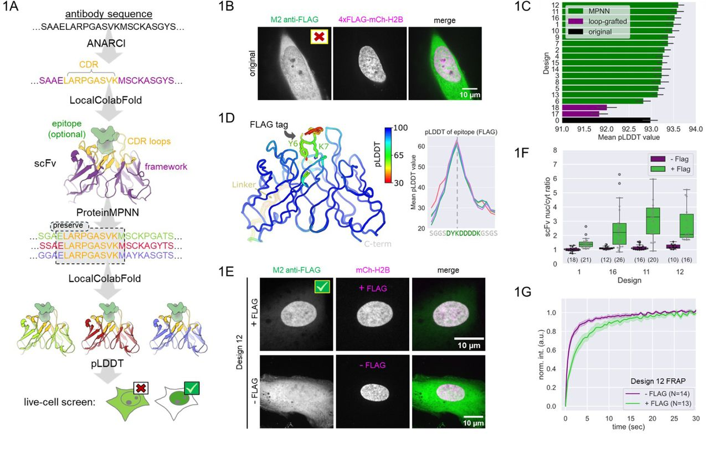

# **AI-assisted protein design to rapidly convert antibody sequences to intrabodies targeting diverse peptides and histone modifications** 

## Set up:
This was written with cuda 11.8 in mind, but should easily be exportable to any other cuda version; no custom GPU development was done. The following major packages are dependencies:
- ANARCI (https://github.com/oxpig/ANARCI)
- localcolabfold ([YoshitakaMo/localcolabfold: ColabFold on your local PC](https://github.com/YoshitakaMo/localcolabfold)) 
- ProteinMPNN ([dauparas/ProteinMPNN: Code for the ProteinMPNN paper](https://github.com/dauparas/ProteinMPNN))

And there are the following python dependencies:
- Python 3.9
- Biopython (should get installed when you install ANARCI)
- NumPy (should get installed with both ANARCI and ProteinMPNN)
- Matplotlib
- Scipy
- PyTorch (should get installed with ProteinMPNN)
- Web Logo

A `requirements.txt` file is not provided because 99% of the setup for this project is getting ANARCI, localcolabfold, and ProteinMPNN set up and operational in a singular environment. The extraneous libraries are very easy to install after getting the major 3 operational. If you find it useful, the conda env for this project is provided in `environment.yaml` - but again, it is highly recommended to install each of the 3 major dependicies independently, and not with this `.yaml` file. 

## Set up code:
conda remove --name scFv --all.
conda create -p /group/ll010/hgao/conda_env/scFv python=3.10 -y
conda activate /group/ll010/hgao/conda_env/scFv.

download and install hmmer : 
wget http://eddylab.org/software/hmmer/hmmer-3.3.2.tar.gz.
tar -xvzf hmmer-3.3.2.tar.gz.
cd hmmer-3.3.2.
customize install path:
./configure --prefix=/group/ll010/hgao/apps/hmmer-3.3.2.
make.
make install.
echo 'export PATH=/group/ll010/hgao/apps/hmmer-3.3.2/bin:$PATH' >> ~/.bashrc.
source ~/.bashrc.

pip install biopython.
install ANARCI :
git clone https://github.com/oxpig/ANARCI.git.
cd ANARCI.
python setup.py install.
install colabbatch :
pip install colabfold[alphafold].
vim ~/.bashrc.
export COLABFOLD_CACHE_DIR=/group/ll010/hgao/apps/colabfold_cache.
install ProteinMPNN :
git clone https://github.com/dauparas/ProteinMPNN.git.
echo 'export PATH=/group/ll010/hgao/apps/ProteinMPNN:$PATH' >> ~/.bashrc.
source ~/.bashrc.
pip install torch torchvision torchaudio.
pip install torch==2.1.0+cu113 --index-url https://download.pytorch.org/whl/cu113.
install scFv_Pmpnn_AF2 :
scFv_Pmpnn_AF2.
git clone https://github.com/jbderoo/scFv_Pmpnn_AF2.git.
~/.bashrc.
/group/ll010/hgao/apps/scFv_Pmpnn_AF2.
pip install torch torchvision torchaudio.

## 1️⃣ 创建并激活 Conda 环境

```bash
# 删除旧环境（如已存在）
conda remove --name scFv --all

# 创建新环境（Python 3.10）
conda create -p /group/ll010/hgao/conda_env/scFv python=3.10 -y

# 激活环境
conda activate /group/ll010/hgao/conda_env/scFv
```

---

## 2️⃣ 下载并安装 HMMER

```bash
# 下载 HMMER 源码
wget http://eddylab.org/software/hmmer/hmmer-3.3.2.tar.gz

# 解压并进入目录
tar -xvzf hmmer-3.3.2.tar.gz
cd hmmer-3.3.2

# 自定义安装路径
./configure --prefix=/group/ll010/hgao/apps/hmmer-3.3.2
make
make install

# 添加到 PATH
echo 'export PATH=/group/ll010/hgao/apps/hmmer-3.3.2/bin:$PATH' >> ~/.bashrc
source ~/.bashrc
```

---

## 3️⃣ 安装 Biopython

```bash
pip install biopython
```

---

## 4️⃣ 安装 ANARCI

```bash
# 克隆 ANARCI 仓库
git clone https://github.com/oxpig/ANARCI.git
cd ANARCI

# 安装 ANARCI
python setup.py install
```

---

## 5️⃣ 安装 ColabFold（含 AlphaFold）

```bash
pip install colabfold[alphafold]

# 设置缓存路径
vim ~/.bashrc
# 在文件中添加：
export COLABFOLD_CACHE_DIR=/group/ll010/hgao/apps/colabfold_cache

# 使修改生效
source ~/.bashrc
```

---

## 6️⃣ 安装 ProteinMPNN

```bash
# 克隆 ProteinMPNN 仓库
git clone https://github.com/dauparas/ProteinMPNN.git

# 添加到 PATH
echo 'export PATH=/group/ll010/hgao/apps/ProteinMPNN:$PATH' >> ~/.bashrc
source ~/.bashrc
```

---

## 7️⃣ 安装 PyTorch

> ⚠️ 如果机器支持 CUDA 11.3：

```bash
pip install torch==2.1.0+cu113 --index-url https://download.pytorch.org/whl/cu113
```

> 或安装标准版本：

```bash
pip install torch torchvision torchaudio
```

---

## 8️⃣ 安装 scFv_Pmpnn_AF2

```bash
# 克隆仓库
git clone https://github.com/jbderoo/scFv_Pmpnn_AF2.git

# 设置路径（假设安装到 apps）
cd /group/ll010/hgao/apps/scFv_Pmpnn_AF2
echo 'export PATH=/group/ll010/hgao/apps/scFv_Pmpnn_AF2:$PATH' >> ~/.bashrc
source ~/.bashrc
```

---

## ✅ 环境验证

```bash
# 检查关键组件是否可用
which hmmscan
which anarci
which colabfold_batch
which python
python -c "import torch; print(torch.__version__)"
```

## Usage
This pipeline was written with ease of use in mind. There are two scripts worth mentioning here. The first being the scFv-ification of antibody sequences (`scripts/scfv_anarci.py`), and the second being the actual run pipeline itself (`af2_pmpnn.sh`). 

### scFv-ification of an antibody
An scFv (single chain variable fragment) is an antibody with only the CDR loops and variable region framework, of both the constant and heavy chains. A flexible linker is then used to combine the remaining regions to create and a single chain domain. The process of doing this is tedious and time consuming by hand; identify the CDR regions, identify the variable and constant regions, and stitch them together. For both speed and consistency, a script was written to quickly automate this process.

Let’s use the hemagglutinin (HA) Heavy and Light chains for our example, called `HA.fasta` :
```
>HA_heavy
MKLPVLLVVLLLFTSPASSSEVKLVESGGDLVKPGGSLKLSCAASGFTFSSYGMSWVRQTPDKRLEWVATISRGGSYTYYPDSVKGRFTISRDNAKNTLYLQMSSLKSEDTAMYYCARRETYDEKGFAYWGQGTTVTVSSARPTAPSVYPLAPVCGDTTGSSVTLGCLVKGYFPEPVTLTWNSGSLSSGVHTFPAVLQSDLYTLSSSVTVTSSTWPSQSITCNVAHPASSTKVDKKIEPRGPTIKPCPPCKCPAPNLLGGPSVFIFPPKIKDVLMISLSPIVTCVVVDVSEDDPDVQISWFVNNVEVHTAQTQTHREDYNSTLRVVSALPIQHQDWMSGKEFKCKVNNKDLPAPIERTISKPKGSVRAPQVYVLPPPEEEMTKKQVTLTCMVTDFMPEDIYVEWTNNGKTELNYKNTEPVLDSDGSYFMYSKLRVEKKNWVERNSYSCSVVHEGLHNHHTTKSFSRTPGK
>HA_light
MTSTLPFSPQVSTPRSKFATMEFQTQVLMSLLLCMSGAAADIELTQSPSSLTVTAGEKVTMSCKSSQSLLNSGNQKNYLTWYQQKPGQPPKLLIYWASTRESGVPDRFTGSGSGRDFTLTISSVQAEDLAVYYCQNDNSHPLTFGAGTKLELKRADAAPTVSIFPPSSEQLTSGGASVVCFLNNFYPKDINVKWKIDGSERQNGVLNSWTDQDSKDSTYSMSSTLTLTKDEYERHNSYTCEATHKTSTSPIVKSFNRNEC
```

Identifing the variable regions, and stitching them together with the default flexible linker (`GGGGS` x3):
`scfv_anarci.py HA.fasta`
Yeilds the scFv sequence printed to the screen:
`MEVKLVESGGDLVKPGGSLKLSCAASGFTFSSYGMSWVRQTPDKRLEWVATISRGGSYTYYPDSVKGRFTISRDNAKNTLYLQMSSLKSEDTAMYYCARRETYDEKGFAYWGQGTTVTVSSGGGGSGGGGSGGGGSDIELTQSPSSLTVTAGEKVTMSCKSSQSLLNSGNQKNYLTWYQQKPGQPPKLLIYWASTRESGVPDRFTGSGSGRDFTLTISSVQAEDLAVYYCQNDNSHPLTFGAGTKLELK`

If you’d like to use any other sequence besides the default, this is easily changable with the `—linker-seq` flag. Note that this DOES NOT check for legitimate amino acids:

`scfv_anarci.py HA.fasta --linker-seq GSGSGSGSGSGSGSG`
`MEVKLVESGGDLVKPGGSLKLSCAASGFTFSSYGMSWVRQTPDKRLEWVATISRGGSYTYYPDSVKGRFTISRDNAKNTLYLQMSSLKSEDTAMYYCARRETYDEKGFAYWGQGTTVTVSSGSGSGSGSGSGSGSGDIELTQSPSSLTVTAGEKVTMSCKSSQSLLNSGNQKNYLTWYQQKPGQPPKLLIYWASTRESGVPDRFTGSGSGRDFTLTISSVQAEDLAVYYCQNDNSHPLTFGAGTKLELK`

`scfv_anarci.py HA.fasta --linker-seq __science_is_cool__`
`MEVKLVESGGDLVKPGGSLKLSCAASGFTFSSYGMSWVRQTPDKRLEWVATISRGGSYTYYPDSVKGRFTISRDNAKNTLYLQMSSLKSEDTAMYYCARRETYDEKGFAYWGQGTTVTVSS__science_is_cool__DIELTQSPSSLTVTAGEKVTMSCKSSQSLLNSGNQKNYLTWYQQKPGQPPKLLIYWASTRESGVPDRFTGSGSGRDFTLTISSVQAEDLAVYYCQNDNSHPLTFGAGTKLELK`

If you’d like to save your sequence to a file, use the `--output` flag.
`scfv_anarci.py HA.fasta --output HA_scfv` Will produce the file `HA_scfv.fasta` with sequence title `>HA_scfv`. And if we look inside that file:
```
$ cat HA_scfv.fasta

>HA_scfv
MEVKLVESGGDLVKPGGSLKLSCAASGFTFSSYGMSWVRQTPDKRLEWVATISRGGSYTYYPDSVKGRFTISRDNAKNTLYLQMSSLKSEDTAMYYCARRETYDEKGFAYWGQGTTVTVSSGGGGSGGGGSGGGGSDIELTQSPSSLTVTAGEKVTMSCKSSQSLLNSGNQKNYLTWYQQKPGQPPKLLIYWASTRESGVPDRFTGSGSGRDFTLTISSVQAEDLAVYYCQNDNSHPLTFGAGTKLELK
```

### scFv Framework Optimization
Now that we’ve successfully created an scFv sequence, we can optimize its framework with the pipeline that is the crux of the protein design aspect of the paper. The heart and soul of the pipeline is the `af2_pmpnn.sh` bash script. In it are a handful of input variables that we’ll go over briefly.

`folder_with_pdbs="input_dir"` Is the input directory where all pdbs or fastas (one scFv per fasta!) we want to redesign the framework of should go. 

`seqs_per_run=3`  is the number of sequences to generate via ProteinMPNN for the scFv framework.

`determine_CDRs="martin"`  Is the method with which to determine the CDRs of the scFv. There are four supported options here:
`martin`, `kabat`, and `chothia` are all self explanatory. These are the sequence numbering schemes with which the literature has widly used to identify CDRs in an antibody.
The fourth and final one is `structure` . This takes a structure based approach (as opposed to sequence for the other 3) to identifying the CDR loops. A peptide and the scFv have their structure predicted via AF2, then all the residues within 6 angstroms of that peptide are considered the “CDRs”, and they are not allowed to mutate.

`simple_grab=true` is used to determine how do we determine what residues are near the CDRs. For example, if two residues are near a CDR and create a “bridge” if 1 residue that isn’t, this residue would be allowed to change if `simple_grab` is set to `true`. However, if we set this to `false`, then that residue would artificially be considered part of the group of residues near the CDR loops that are not allowed to change. 

`output_dir="output_dir”` the name of the output directory

`to_design="framework"` What are we redesigning during this run? This was put in to help with other projects from the Snow, Geiss, and Stasevich labs. `to_design` is only allowed to be 1 of 3 things: `framework` to redesign the framework of the scFv, `loops` to redesign the loops of the scFv, and `lss` to redesign both the loops and the secondary shell of the loops (all residues within 4A of the loops, modified by `simple_grab`). 

`PMPNN='path/to/my/ProteinMPNN'` Path to the ProteinMPNN directory 

In the output directory, there are 4 key files to look at (continuing our HA example):
`HA_noWT.fa` contains all of the framework designed sequences that are produced.
`HA_sequence_log.png` is an image of the sequence logo of the designed framework.
`HA_plddt.png` is a plot of the pLDDT’s ([pLDDT: Understanding local confidence | AlphaFold](https://www.ebi.ac.uk/training/online/courses/alphafold/inputs-and-outputs/evaluating-alphafolds-predicted-structures-using-confidence-scores/plddt-understanding-local-confidence/)) for each scFv.
`HA_ptm.png` is a plot of the pTM’s ([Confidence scores in AlphaFold-Multimer | AlphaFold](https://www.ebi.ac.uk/training/online/courses/alphafold/inputs-and-outputs/evaluating-alphafolds-predicted-structures-using-confidence-scores/confidence-scores-in-alphafold-multimer/)) for each scFv. 

To make our sequence selections, we took the top sequences that performed well in both pLDDT and pTM. 

## TODO 
Dockerfile / Docker image

# 🧪 Usage on My Own Pipeline

## Step 1️⃣ Decode FASTA Files
Decode FASTA files and create split files for parallel running.

```bash
# Example command (replace with your actual script or function)
step1_decode_fasta.slurm
```

This step prepares smaller FASTA chunks for distributed processing.

---

## Step 2️⃣ Submit Parallel Jobs

Use SLURM to run the pipeline in parallel.

```bash
sbatch step2_scFv_parallel.slurm
```

This will execute multiple jobs across available compute nodes based on your SLURM configuration.
